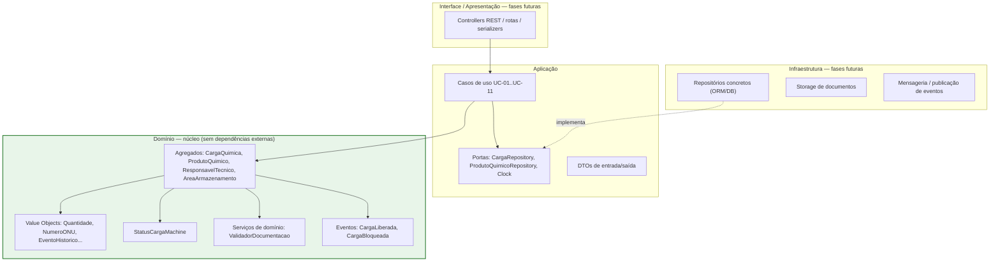
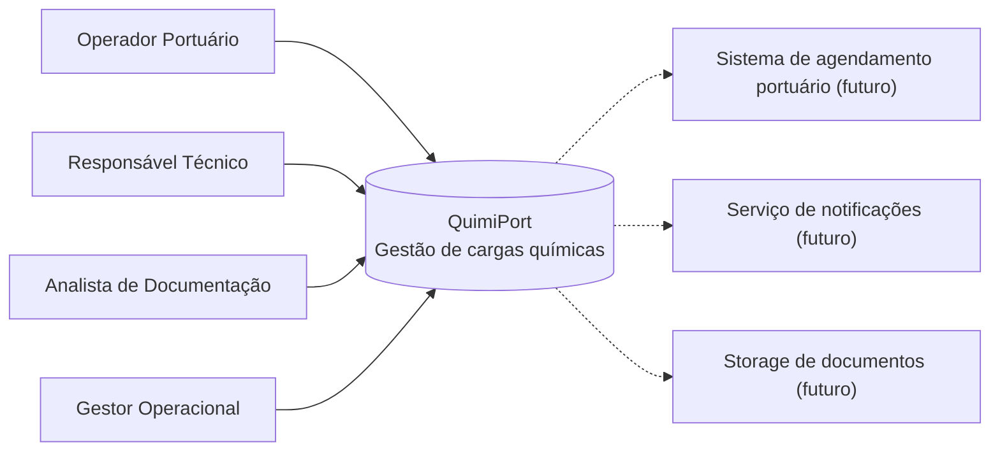

# Diagrama de Arquitetura em Camadas e Contexto *(sugestões atendidas)*

## Arquitetura em camadas

```mermaid
flowchart TB
    subgraph INTERFACE["Interface / Apresentação — fases futuras"]
        HTTP["Controllers REST / rotas / serializers"]
    end

    subgraph INFRA["Infraestrutura — fases futuras"]
        REPO["Repositórios concretos (ORM/DB)"]
        STOR["Storage de documentos"]
        MSG["Mensageria / publicação de eventos"]
    end

    subgraph APP["Aplicação"]
        UC["Casos de uso UC-01..UC-11"]
        PORTS["Portas: CargaRepository, ProdutoQuimicoRepository, Clock"]
        DTO["DTOs de entrada/saída"]
    end

    subgraph DOM["Domínio — núcleo (sem dependências externas)"]
        AG["Agregados: CargaQuimica, ProdutoQuimico, ResponsavelTecnico, AreaArmazenamento"]
        VO["Value Objects: Quantidade, NumeroONU, EventoHistorico..."]
        SM["StatusCargaMachine"]
        DS["Serviços de domínio: ValidadorDocumentacao"]
        EV["Eventos: CargaLiberada, CargaBloqueada"]
    end

    HTTP --> UC
    UC --> AG
    UC --> PORTS
    REPO -. "implementa" .-> PORTS
    AG --> VO & SM & DS & EV

    style DOM fill:#e8f5e9,stroke:#2e7d32,stroke-width:2px
```

## Diagrama de contexto (C4 nível 1 — simplificado)

```mermaid
flowchart LR
    OP["Operador Portuário"]
    RT["Responsável Técnico"]
    AD["Analista de Documentação"]
    GO["Gestor Operacional"]

    QP[("QuimiPort<br/>Gestão de cargas químicas")]

    EXT1["Sistema de agendamento portuário (futuro)"]
    EXT2["Serviço de notificações (futuro)"]
    EXT3["Storage de documentos (futuro)"]

    OP & RT & AD & GO --> QP
    QP -.-> EXT1 & EXT2 & EXT3
```
