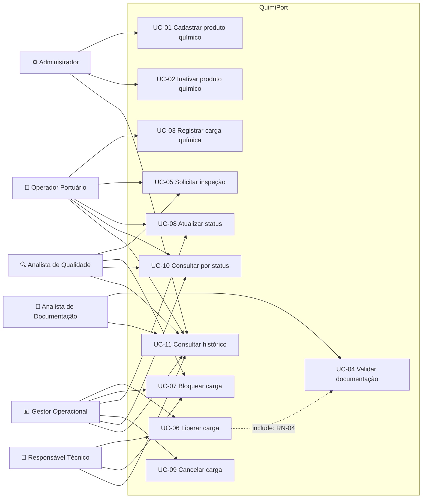

# Diagrama de Casos de Uso *(sugestão atendida)*

```mermaid
flowchart LR
    subgraph SISTEMA["QuimiPort"]
        UC01["UC-01 Cadastrar produto químico"]
        UC02["UC-02 Inativar produto químico"]
        UC03["UC-03 Registrar carga química"]
        UC04["UC-04 Validar documentação"]
        UC05["UC-05 Solicitar inspeção"]
        UC06["UC-06 Liberar carga"]
        UC07["UC-07 Bloquear carga"]
        UC08["UC-08 Atualizar status"]
        UC09["UC-09 Cancelar carga"]
        UC10["UC-10 Consultar por status"]
        UC11["UC-11 Consultar histórico"]
    end

    OP["👷 Operador Portuário"]
    RT["🧪 Responsável Técnico"]
    AD["📄 Analista de Documentação"]
    AQ["🔍 Analista de Qualidade"]
    GO["📊 Gestor Operacional"]
    AS["⚙️ Administrador"]

    AS --> UC01 & UC02
    OP --> UC03 & UC05 & UC08 & UC10
    AD --> UC04
    AQ --> UC05 & UC07 & UC10
    RT --> UC06 & UC07
    GO --> UC06 & UC07 & UC08 & UC09 & UC10

    OP & RT & AD & AQ & GO & AS --> UC11

    UC06 -. "include: RN-04" .-> UC04
```
