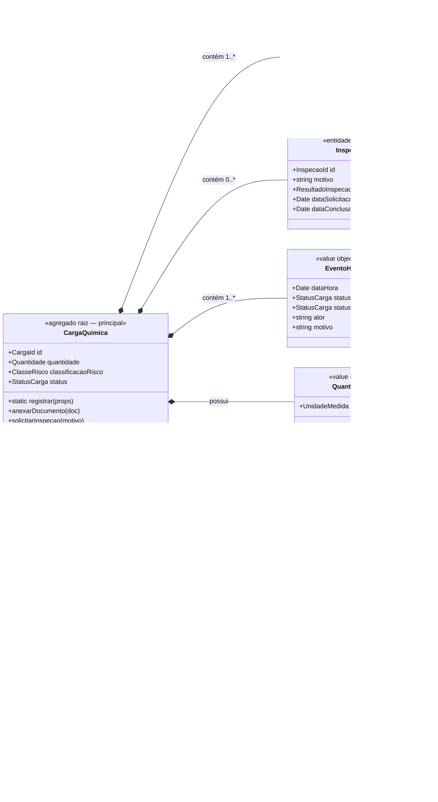
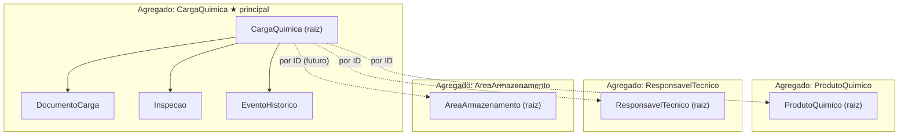

# Diagrama de Domínio — Agregados e Entidades *(obrigatório)*

Visão dos agregados, entidades, value objects e seus relacionamentos, com as fronteiras de agregado destacadas.

## Leitura do diagrama

- **Composição (`*--`)**: `DocumentoCarga`, `Inspecao` e `EventoHistorico` vivem **dentro** do agregado `CargaQuimica` — não existem sozinhos e só são alterados pela raiz;
- **Referência por ID (`-->`)**: entre agregados, apenas IDs tipados — `CargaQuimica` não carrega `ProdutoQuimico` inteiro;
- **Linha tracejada (`..>`)**: relação planejada para evolução futura (alocação de carga em área).

## Visão de fronteiras (bounded view)

