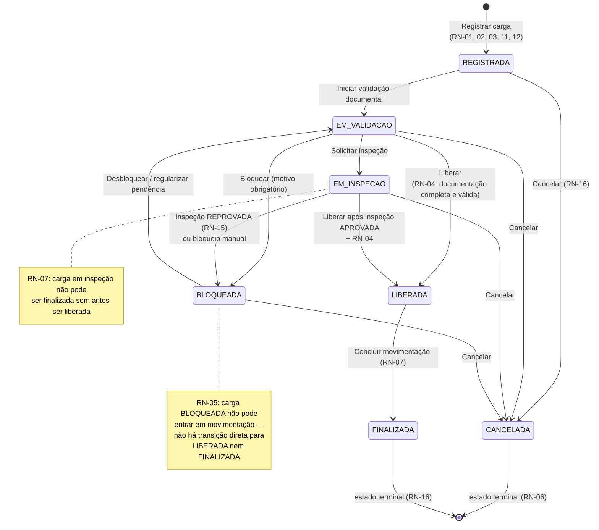

# Fluxo de Transição de Status da Carga Química *(obrigatório)*

Máquina de estados da `CargaQuimica`. Toda transição passa por `transicionarStatus()` na raiz do agregado, que valida o caminho permitido e registra um `EventoHistorico` (RN-13).

## Tabela de transições (fonte de verdade para testes)

| # | De | Para | Gatilho | Regra(s) |
|---|---|---|---|---|
| T1 | *(início)* | REGISTRADA | Registrar carga | RN-01, RN-02, RN-03, RN-11, RN-12 |
| T2 | REGISTRADA | EM_VALIDACAO | Iniciar validação | — |
| T3 | EM_VALIDACAO | EM_INSPECAO | Solicitar inspeção | — |
| T4 | EM_VALIDACAO | LIBERADA | Liberar carga | RN-04 |
| T5 | EM_VALIDACAO | BLOQUEADA | Bloquear | motivo obrigatório |
| T6 | EM_INSPECAO | LIBERADA | Liberar pós-inspeção | inspeção APROVADA + RN-04 |
| T7 | EM_INSPECAO | BLOQUEADA | Inspeção reprovada / bloqueio | RN-15 |
| T8 | BLOQUEADA | EM_VALIDACAO | Desbloquear | motivo obrigatório |
| T9 | LIBERADA | FINALIZADA | Concluir movimentação | RN-07 |
| T10 | REGISTRADA / EM_VALIDACAO / EM_INSPECAO / BLOQUEADA | CANCELADA | Cancelar carga | RN-16 |
| — | CANCELADA / FINALIZADA | *(qualquer)* | — | ❌ proibido (RN-06, RN-16) |
| — | BLOQUEADA | LIBERADA / FINALIZADA | — | ❌ proibido (RN-05) |
| — | EM_INSPECAO | FINALIZADA | — | ❌ proibido (RN-07) |

> **Garantia de implementação:** a tabela acima será codificada em `StatusCargaMachine.ts` como estrutura de dados (`Record<StatusCarga, StatusCarga[]>`), e cada linha terá teste unitário correspondente (ver plano de qualidade).
